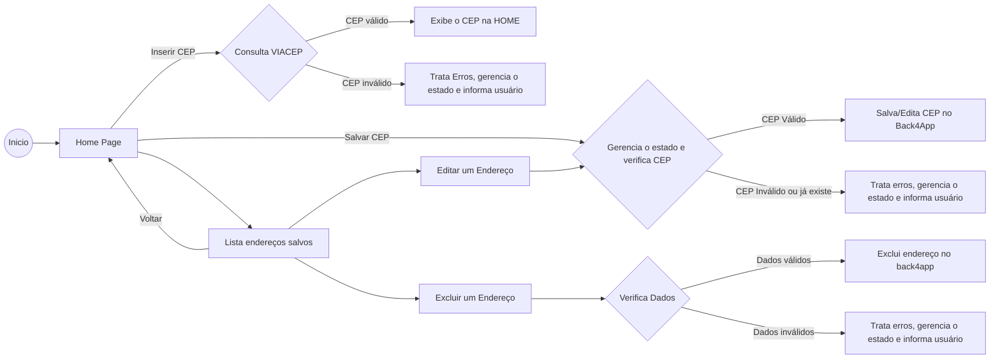

# Projeto de Ceps - CepHub.

Projeto de repositório de endereços e cep - Fatec 2024. 
<b>OBS:</b> O arquivo .env foi enviado ao professor pelo teams.

## Alunos:
- Otávio Thadeu Franklin da Cunha 
- Cleber Pereira dos Santos Junior 
- Pedro Henrique Leite dos Santos 

## Requisitos:
<ol>
    <li>- [x] Nome dos integrantes no readme do projeto no GitHub​</li>
    <li>- [x] Uso de uma classe de Bloc para gerenciar o estado de alguma coisa no app</li>
    <li>- [x] Organizar o projeto de acordo com as práticas mostradas em aula</li>
    <li>- [x] O aplicativo deve conter mais de uma tela</li>
    <li>- [x] O tema do aplicativo fica como escolha livre do grupo.</li>
</ol>

## Bibliotecas utilizadas:
<ol>
    <li>- [x] Back4App para armazenar os dados​</li>
    <li>- [x] Flutter_dotenv para gerenciar as api_keys</li>
    <li>- [x] Flutter_bloc para gerenciamento de estado das telas</li>
    <li>- [x] Equatable para controlar os dados de estado das telas</li>
    <li>- [x] Http para consultar os dados de cep</li>
    <li>- [x] Dio para consultar os dados da api</li>
</ol>
  
## Fluxograma:

### Minhas redes sociais, conecte-se comigo:

### Um pouco do meu GitHub:

